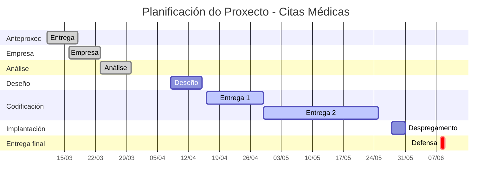

# Anteproxecto

- [Anteproxecto](#anteproxecto)
  - [1- Idea do proxecto](#1--idea-do-proxecto)
  - [2- Contextualización](#2--contextualización)
  - [3- Estudio de alternativas e viabilidade](#3--estudio-de-alternativas-e-viabilidade)
    - [3.1- Estudio de alternativas](#31--estudio-de-alternativas)
    - [3.2 Xustificación da alternativa](#32-xustificación-da-alternativa)
  - [4- Requirimentos técnicos](#4--requirimentos-técnicos)
  - [5- Planificación](#5--planificación)

## 1- Idea do proxecto

O proxecto consiste nunha aplicación web para a xestión de citas médicas que, ademais de permitir reservar, consultar e modificar citas, ofrece ao paciente unha estimación dinámica da hora real na que será atendido. A idea é que, se por exemplo tes unha cita ás 17:00 cun médico pero a consulta leva uns 45 minutos de retraso, a aplicación poida recomendarche chegar ás 17:30, reducindo así o tempo perdido na sala de espera. O sistema calculará o atraso estimado en función das citas previas, o histórico de tempos de atención de cada profesional e a situación en tempo real da consulta, mostrando sempre ao paciente unha “hora de chegada recomendada” que se actualizará automaticamente. Ademais, a aplicación poderá enviar notificacións ao móbil cando haxa cambios relevantes no atraso, para que o usuario poida organizar mellor o seu tempo.

## 2- Contextualización

Na actualidade existen numerosas aplicacións e portais web que permiten pedir cita co médico de xeito online, tanto en sistemas públicos de saúde como en aseguradoras privadas, facilitando a reserva de hora, a consulta de dispoñibilidade e o recordatorio da cita. Porén, a maioría destas solucións céntranse en programar e recordar a cita, pero non teñen en conta un problema moi habitual para as persoas usuarias: os atrasos acumulados nas consultas, que provocan longas esperas innecesarias. Moitas clínicas e centros sanitarios están a incorporar recordatorios por SMS ou notificacións para reducir as ausencias e mellorar o fluxo de pacientes, mais aínda é pouco frecuente atopar ferramentas que estimen de forma explícita o tempo de espera restante ou o atraso previsto en cada momento.

 
O propósito principal da aplicación é mellorar a experiencia do paciente reducindo o tempo perdido en sala de espera, ofrecendo información máis realista sobre cando será atendido. Para iso, a app mostrará a hora oficial da cita e a hora estimada de atención, baseada no número de pacientes pendentes, nos tempos medios de consulta e noutros factores (por exemplo, atrasos acumulados ao longo da tarde). Isto permite que o paciente poida saír máis tarde da casa, aproveitar mellor o seu tempo ou, no caso de grandes atrasos, decidir reprogramar a cita. A nivel de obxectivos, búscase: reducir os tempos de espera presenciais, mellorar a comunicación entre centro e paciente, ofrecer máis transparencia na xestión das axendas médicas e facilitar a organización diaria das persoas usuarias.

 
Desde o punto de vista de negocio, unha ferramenta deste tipo pode resultar interesante para clínicas privadas, centros médicos especializados e incluso para sistemas públicos que queiran mellorar a satisfacción dos pacientes e optimizar o uso dos recursos. Xa existen solucións comerciais de software de programación de citas que permiten ver dispoñibilidade en tempo real e envían recordatorios automatizados para reducir ausencias, polo que unha aplicación centrada especificamente na estimación de atrasos podería integrarse como módulo adicional ou diferenciarse ofrecendo métricas de tempo de espera e modelos sinxelos de predición. Isto abre a porta a comercializar o produto como servizo (modelo SaaS) para centros sanitarios que desexen mellorar a súa imaxe e eficiencia, pagando unha cota mensual por profesional ou por centro. Ademáis podería implementarse en outros contextos como unha cita na ITV ou nunha peluquería.

## 3- Estudio de alternativas e viabilidade

### 3.1- Estudio de alternativas

Para o desenvolvemento da aplicación plántéxanse varias alternativas tecnolóxicas para o backend e o frontend, tendo en conta os coñecementos actuais, o tempo dispoñible para o proxecto e os custos de infraestrutura:

Alternativas

- A1- Desenvolvemento dende cero con modelo MVC en PHP + HTML5 + CSS3 + JavaScript nativo.
- A2- Desenvolvemento con framework Laravel (PHP) para o backend + HTML5 + CSS3 + algo de JavaScript nativo no frontend.
- A3- Desenvolvemento dende cero con API Rest Java Spring Boot + HTML5 + CSS3 + JavaScript nativo.
 
| **Alternativa** |  **Viabilidade técnica** | **Viabilidade económica** | **Temporalidade** | **Valoración Global** |
| ------ | ------ |  ------ | ------ | ------ |
| A1 | Alta (9/10): PHP + MVC desde cero utiliza tecnoloxías coñecidas no ciclo formativo, cunha curva de aprendizaxe menor. **Fortalezas**: sinxeleza, rapidez para construír CRUDs de citas, usuarios e médicos. **Debilidades**: hai que implementar manualmente certas capas (seguridade, validacións avanzadas, etc.). | Alta (9/10): un hosting compartido con soporte PHP e base de datos MySQL é moi económico, polo que os custos de despregue son baixos. | Alta (8/10): pode desenvolverse un prototipo funcional en 2–3 meses grazas ao dominio previo das tecnoloxías. | **9/10** |
| A2 | Media (6/10): Laravel ofrece moitas funcionalidades listas para usar (autenticación, migracións, ORM), pero require certa aprendizaxe inicial. **Fortalezas**: estrutura clara, código máis organizado e mantible. **Debilidades**: tempo adicional para aprender o framework e configurar o proxecto. | Alta (8/10): os requisitos de hosting son algo maiores (PHP moderno, Composer, a miúdo SSH), pero segue sendo asumible para un proxecto pequeno. | Media (5/10): a curva de aprendizaxe de Laravel e a configuración poden alongar o desenvolvemento ata 4–5 meses. | **6/10** |
| A3 | Baixa-media (4/10): Spring Boot é un framework empresarial potente para crear APIs REST completas, con excelente soporte para JPA/Hibernate e seguridade integrada. **Fortalezas**: arquitectura sólida, escalable e profesional; exemplos reais de apps de citas médicas con Spring Boot. **Debilidades**: curva de aprendizaxe alta (anotacións, configuración de Spring, Maven/Gradle, Java avanzado), especialmente se non hai experiencia previa. | Media-baixa (5/10): require hosting con soporte Java (VPS, Render, Railway ou GCP con opcións free tier limitadas), mais caro que PHP compartido e con menos opcións gratuítas sinxelas. | Baixa (3/10): desenvolvemento e aprendizaxe poden levar 5–7 meses para un prototipo funcional.| **4/10** |

Ademais das tecnoloxías puras, tamén se poderían estudar opcións de integración con servizos de terceiros (por exemplo, plataformas de envío de SMS ou notificacións por correo) para informar ao paciente sobre cambios na súa hora estimada de atención, algo que xa utilizan moitas solucións de cita médica para recordatorios.

### 3.2 Xustificación da alternativa

A alternativa que se consolida como máis viable para este proxecto é A1: desenvolvemento modelo MVC en PHP con HTML5, CSS3 e JavaScript nativo. As razóns principais desta elección son:

- É a opción máis equilibrada entre viabilidade técnica e tempo dispoñible, aproveitando tecnoloxías xa coñecidas no ciclo formativo e reducindo a curva de aprendizaxe.
- O custo de despregue é moi baixo, xa que practicamente calquera hosting compartido económico ofrece soporte PHP e base de datos, suficiente para un proxecto académico.
- Permite centrarse na lóxica específica da aplicación (xestión de citas, cálculo de atrasos, notificacións ao usuario) en lugar de invertir demasiado tempo en aprender e configurar frameworks complexos.
- Facilita obter un prototipo funcional nun prazo razoable, que se poida presentar e probar con usuarios, e que máis adiante se podería migrar ou escalar a un stack máis avanzado (Laravel, Node.js, React, etc.).
- A estrutura MVC en PHP é suficiente para organizar o código en capas (modelos de citas, médicos e usuarios, controladores para a lóxica de negocio e vistas para a interface web) mantendo unha separación mínima pero clara.

 As opcións A3 (Spring Boot) e A2 (Larabel + React) resultan menos axeitadas pola súa complexidade e custo. Serían viables se tivésemos máis tempo.

## 4- Requirimentos técnicos

Para desenvolver a aplicación proponse a seguinte lista de requirimentos técnicos:

- **Infraestrutura:**
   - Dominio web básico para acceso á aplicación (pode comezar cun subdominio do propio hosting).
   - Servidor de hosting compartido con soporte para PHP 8.x e base de datos MySQL/MariaDB.
   - Servidor de base de datos para almacenar usuarios, médicos, citas, tempos de atención, atrasos históricos, etc.
   - Espazo de almacenamento suficiente para a base de datos e posibles rexistros de actividade (logs).
   - Posibilidade de configurar tarefas programadas (cron jobs) para actualizar periodicamente estatísticas ou enviar notificacións.

- **Backend:**
   - Linguaxe de programación: PHP (programación estruturada e orientación a obxectos).
   - Patrón de deseño: MVC dende cero (separando modelos, controladores e vistas).
   - Base de datos relacional: MySQL ou MariaDB para xestionar as táboas de usuarios, profesionais sanitarios, citas, estados das citas e rexistros de tempos de consulta.
   - Uso de librerías ou compoñentes adicionais cando sexa necesario (por exemplo, PHPMailer ou similar para envío de correos electrónicos de aviso).
   - API interna sinxela (endpoints en PHP) para devolver datos en formato JSON, permitindo ao frontend actualizar en tempo real ou baixo demanda a estimación de atrasos.
   - Implementación de autenticación básica para usuarios (pacientes) e panel para administración ou persoal da clínica.

- **Frontend:**
   - HTML5 para a estrutura das páxinas (formulario de login, vista de agenda, detalle da cita, etc.).
   - CSS3 (posiblemente con Flexbox e Grid) para deseñar unha interface limpa, adaptada a móbiles e tablets.
   - JavaScript nativo para interaccións dinámicas: consulta periódica da estimación de atraso, actualización da hora recomendada de chegada, avisos ao usuario na interface.
   - Uso opcional dunha pequena librería de UI (por exemplo, un framework CSS lixeiro) se fose necesario para acelerar o deseño, sen introducir demasiada complexidade técnica.

- **Outros servizos e requisitos:**
   - Sistema de notificacións por correo electrónico para informar de cambios importantes na cita ou en atrasos significativos.
   - Posible integración futura con servizos de SMS ou mensaxería para enviar recordatorios, como fan moitas aplicacións de cita médica actuais .
   - Medidas básicas de seguridade: cifrado de contrasinais, validación de formularios, protección fronte a inxeccións SQL e uso de conexións HTTPS no servidor de produción.

## 5- Planificación

[**<-Anterior**](../README.md)
