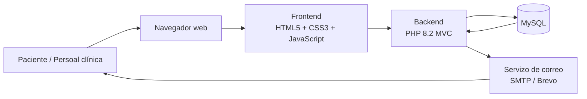
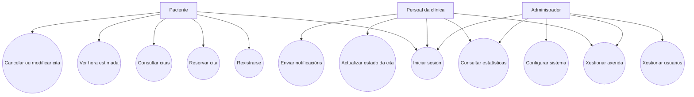
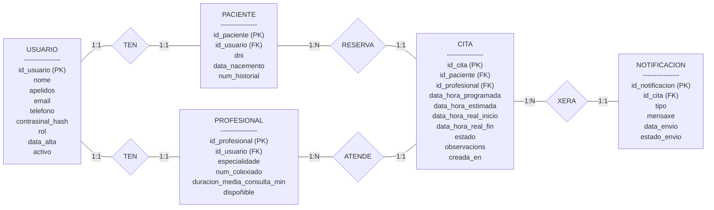
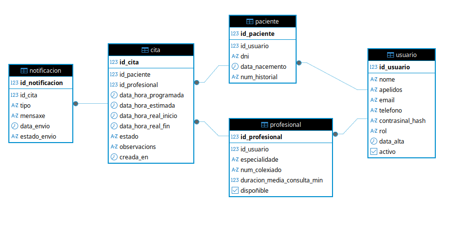
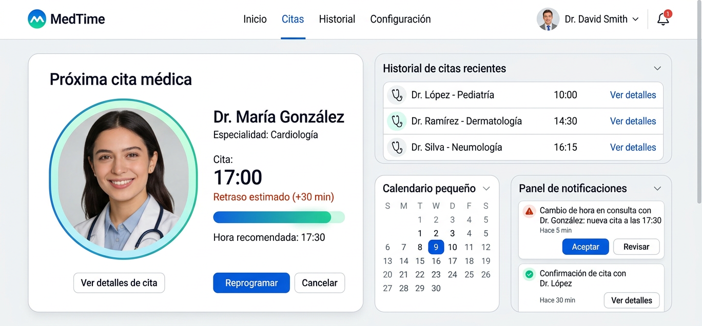

# FASE DE DESEÑO

- [FASE DE DESEÑO](#fase-de-deseño)
  - [1- Diagrama da arquitectura](#1--diagrama-da-arquitectura)
  - [2- Casos de uso](#2--casos-de-uso)
      - [Casos de uso principais](#casos-de-uso-principais)
  - [3- Diagrama de Base de Datos](#3--diagrama-de-base-de-datos)
      - [Entidade/relación](#entidaderelación)
      - [Relacional](#relacional)
  - [4- Deseño de interface de usuarios](#4--deseño-de-interface-de-usuarios)

## 1- Diagrama da arquitectura

A aplicación seguirá unha arquitectura web clásica cliente-servidor, na que o paciente ou o persoal da clínica acceden desde o navegador ao frontend, este comunícase co backend en PHP e o backend realiza as operacións contra a base de datos MySQL. Ademais, o sistema poderá usar un servizo de correo electrónico para o envío de recordatorios e avisos de atraso.

## 2- Casos de uso

A continuación represéntanse os principais casos de uso do sistema, diferenciando os actores que interveñen: paciente, persoal da clínica e administrador.

#### Casos de uso principais

| Caso de uso                | Actor principal         | Descrición                                                      |
| -------------------------- | ----------------------- | --------------------------------------------------------------- |
| Rexistrarse                | Paciente                | Crear unha conta na aplicación.                                 |
| Iniciar sesión             | Todos                   | Acceder ao sistema segundo o rol correspondente.                |
| Reservar cita              | Paciente                | Escoller profesional, data e hora dispoñible.                   |
| Consultar citas            | Paciente                | Ver citas activas e o seu estado.                               |
| Ver hora estimada          | Paciente                | Consultar a estimación actualizada da hora real de atención.    |
| Cancelar ou modificar cita | Paciente                | Cambiar ou anular unha cita existente.                          |
| Actualizar estado da cita  | Persoal da clínica      | Marcar cita como pendente, en curso ou finalizada.              |
| Xestionar axenda           | Persoal / Administrador | Organizar as citas e a dispoñibilidade dos profesionais.        |
| Consultar estatísticas     | Persoal / Administrador | Revisar atrasos medios, carga de traballo e tempos de consulta. |
| Xestionar usuarios         | Administrador           | Crear, editar ou bloquear usuarios do sistema.                  |
| Configurar sistema         | Administrador           | Definir parámetros xerais da aplicación.                        |
| Enviar notificacións       | Sistema / Persoal       | Avisar de recordatorios e cambios na hora estimada.             |

## 3- Diagrama de Base de Datos

#### Entidade/relación

#### Relacional

## 4- Deseño de interface de usuarios

[**<-Anterior**](../../README.md)
