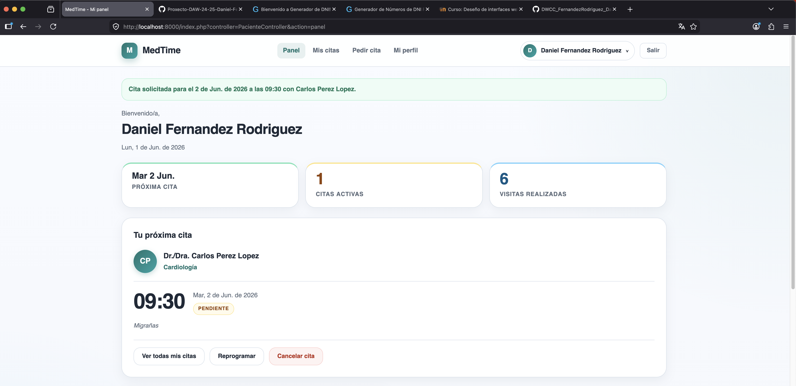

# FASE DE CODIFICACIÓN E PROBAS

- [FASE DE CODIFICACIÓN E PROBAS](#fase-de-codificación-e-probas)
  - [1- Codificación](#1--codificación)
    - [1.1- Arquitectura do código (MVC)](#11--arquitectura-do-código-mvc)
    - [1.2- Tecnoloxías empregadas](#12--tecnoloxías-empregadas)
    - [1.3- Seguridade](#13--seguridade)
    - [1.4- Cambios respecto ao deseño inicial](#14--cambios-respecto-ao-deseño-inicial)
  - [2- Prototipos](#2--prototipos)
    - [Idea inicial](#idea-inicial)
    - [Resultado Panel Principal](#resultado-panel-principal)
  - [3- Innovación](#3--innovación)
    - [3.1- Contedorización con Docker](#31--contedorización-con-docker)
    - [3.2- Algoritmo de estimación de tempos de espera](#32--algoritmo-de-estimación-de-tempos-de-espera)
    - [3.3- Panel de administración con API JSON](#33--panel-de-administración-con-api-json)
  - [4- Probas](#4--probas)
    - [4.1- Probas realizadas](#41--probas-realizadas)
    - [4.2- Problemas atopados e solucións](#42--problemas-atopados-e-solucións)


## 1- Codificación


A aplicación desenvolveuse en **PHP 8.2** seguindo o patrón **Modelo-Vista-Controlador (MVC)**, sen frameworks externos.

### 1.1- Arquitectura do código (MVC)

O proxecto organízase nos seguintes directorios dentro de `code/medtime/`:

```
app/
 ├── controllers/   Lóxica de control e fluxo da aplicación
 ├── models/        Acceso a datos (PDO) e obxectos de valor (vo/)
 ├── views/         Plantillas que xeran o HTML
 ├── core/          Utilidades (ex: Validator de DNI/NIE)
 ├── globals.php    Constantes, configuración de sesión e zona horaria
 └── index.php      Front controller + autoloader
public/
 ├── index.php      Punto de entrada único (DocumentRoot)
 ├── .htaccess      Reescritura de URLs
 └── assets/        CSS e JavaScript
sql/                Scripts de creación, esquema e datos iniciais
docker/             Imaxes de Apache + PHP
```

- **Front controller**: todas as peticións entran por `public/index.php`, que carga `app/index.php`. Alí, el **autoloader** (`spl_autoload_register`) resolve as clases segundo o seu *namespace*, e un **enrutador** sinxelo selecciona o controlador e a acción a partir dos parámetros `?controller=` e `?action=`. Existe unha **lista branca** de controladores permitidos; calquera valor non recoñecido redirixe ao `ErrorController`.
- **Controladores**: estenden unha clase base `Controller` que centraliza redireccións, validación de tokens, control de acceso e mensaxes *flash*. Cada rol ten o seu propio controlador (`PacienteController`, `ProfesionalController`, `AdminController`), ademais de `AuthController` para login/rexistro.
- **Modelos**: estenden a clase `Model`, que proporciona a conexión **PDO** con MariaDB. Todas as consultas empregan **sentencias preparadas** (`prepare` + `bindValue`) para evitar inxección SQL. Os resultados que representan unha entidade complétanse mediante **obxectos de valor** (*Value Objects*) en `models/vo/`.
- **Vistas**: arquivos PHP que reciben un array de datos dende o controlador e xeran o HTML, escapando sempre a saída con `htmlspecialchars` para evitar XSS (Cross-Site Scripting).

### 1.2- Tecnoloxías empregadas

| Capa            | Tecnoloxía                                            |
| --------------- | ----------------------------------------------------- |
| Linguaxe        | PHP 8.2   |
| Servidor web    | Apache 2 con `mod_rewrite`                             |
| Base de datos   | MariaDB 11 (acceso vía PDO)                            |
| Frontend        | HTML5, CSS3 e JavaScript (sen frameworks)             |
| Administración  | phpMyAdmin                                             |
| Contedores      | Docker e Docker Compose                                |

### 1.3- Seguridade

A seguridade tratouse como un requisito transversal dende o comezo da codificación:

- **Contrasinais**: almacénanse cifrados con `password_hash()` (BCRYPT) e compróbanse con `password_verify()`. Nunca se gardan en texto plano.
- **Protección CSRF**: xérase un token por sesión (`random_bytes`) que se valida en todos os formularios POST mediante `hash_equals()`.
- **Endurecemento de sesión**: cookies `HttpOnly`, `SameSite=Strict` e `session.use_strict_mode`. Ao iniciar sesión rexenérase o identificador (`session_regenerate_id`) para evitar fixación de sesión.
- **Control de acceso por roles**: métodos `requireAuth()`, `requireGuest()` e `requireRol()` protexen cada acción segundo o rol do usuario (`PACIENTE`, `PROFESIONAL`, `ADMIN`).
- **Validación de datos**: validación de email, lonxitude de contrasinal e un validador propio de **DNI/NIE** (formato + díxito de control por módulo 23).
- **Servidor**: `.htaccess` desactiva o listado de directorios e o `DocumentRoot` apunta só a `public/`, deixando fóra do alcance público o código da aplicación.

### 1.4- Cambios respecto ao deseño inicial

Durante a codificación tiveron que axustarse algúns aspectos previstos na fase de deseño:

- **Estado `EN_CONSULTA`**: engadiuse aos estados da cita (`PENDIENTE`, `CONFIRMADA`, `EN_CONSULTA`, `FINALIZADA`, `CANCELADA`) para reflectir que un paciente está sendo atendido nese momento, peza clave para o cálculo de tempos.
- **Envío real de correos**: o deseño contemplaba o envío de avisos por SMTP/Brevo. Na implementación, a táboa `notificacion` créase e xéranse os rexistros, pero o **envío real de correos queda como mellora futura**.
- **Motor de base de datos**: optouse por **MariaDB 11** (en contedor) en lugar de MySQL, por ser totalmente compatible e máis sinxelo de despregar con Docker.

## 2- Prototipos

### Idea inicial


### Resultado Panel Principal


## 3- Innovación

Aínda que a base do proxecto emprega tecnoloxías estudadas no ciclo, asumíronse varios retos que foron máis alá do contido habitual.

### 3.1- Contedorización con Docker

En lugar dun servidor local (XAMPP), todo o entorno se definiu con **Docker Compose**, levantando tres servizos coordinados: a aplicación (Apache + PHP 8.2), a base de datos **MariaDB 11** e **phpMyAdmin**. Os scripts SQL execútanse automaticamente na primeira arrincada mediante o `docker-entrypoint-initdb.d`, e un *healthcheck* garante que a web non arranca ata que a base de datos está lista. O reto principal foi configurar a rede interna entre contedores (a aplicación conéctase ao host `mariadb`) e a persistencia dos datos cun volume nomeado.

### 3.2- Algoritmo de estimación de tempos de espera

É a funcionalidade diferencial de MedTime. Cando un profesional **finaliza unha consulta**, o método `recalcularEstimaciones()` recalcula a **hora estimada real** de atención de todas as citas restantes do día:

- Percorre as citas do profesional ordenadas por hora.
- Mantén un *cursor* coa hora na que o profesional quedará libre, tendo en conta a duración media da consulta e os atrasos acumulados das citas xa rematadas.
- Para cada cita pendente calcula a súa nova estimación e propaga o atraso (ou adianto) ás seguintes.

Así, o paciente pode consultar no seu panel **cantos pacientes ten diante**, se hai alguén en consulta e a súa **hora estimada actualizada**, en lugar de fiarse só da hora orixinal de cita.

Esta parte tamén ten moito marxe de mellora de cara ao futuro. A idea e crear un algoritmo que calcule según as citas pasadas o tempo de consulta medio real de cada profesional.

### 3.3- Panel de administración con API JSON

O panel do administrador funciona como unha pequena **SPA**: o `AdminController` expón métodos que devolven **JSON** (altas, modificacións e baixas de usuarios) consumidos mediante `fetch` dende JavaScript, sen recargar a páxina. Inclúe regras de negocio coma impedir que un administrador se elimine a si mesmo ou que se borre o único administrador do sistema.

## 4- Probas

As probas realizáronse de forma **manual e funcional**, percorrendo os fluxos completos de cada rol sobre os datos de proba cargados en `03_inserts.sql`.

### 4.1- Probas realizadas

| Área                 | Proba                                                                 | Resultado |
| -------------------- | --------------------------------------------------------------------- | --------- |
| Autenticación        | Login con credenciais correctas e incorrectas; conta desactivada      | Correcto  |
| Rexistro             | Validación de email, contrasinal, confirmación e DNI/NIE              | Correcto  |
| Control de acceso    | Acceso a accións doutro rol ou sen sesión iniciada                    | Redirixe  |
| Reserva de cita      | Selección de profesional, calendario, slots e antelación mínima       | Correcto  |
| Conflitos de horario | Reserva sobre un slot xa ocupado ou no pasado                        | Bloquea   |
| Estimación de tempos | Iniciar/finalizar consulta e recálculo da cola                       | Correcto  |
| Reprogramación       | Cambio de data/hora e bloqueo da hora orixinal                       | Correcto  |
| Cancelar/confirmar   | Confirmación só o día da cita; cancelación de citas activas           | Correcto  |
| Panel admin (JSON)   | Alta, edición e baixa de usuarios; non eliminar único admin           | Correcto  |
| Seguridade           | Envío de formulario sen token CSRF                                    | 403       |

### 4.2- Problemas atopados e solucións

- **Conexión entre contedores**: ao principio a aplicación non atopaba a base de datos por intentar conectarse a `localhost`. Solucionouse usando o **nome do servizo** (`mariadb`) como host e engadindo un *healthcheck* con `depends_on: condition: service_healthy`.
- **Solapamento de citas**: detectouse que se podían reservar dúas citas no mesmo oco. Engadiuse a detección de **conflitos por intervalos** en `generarSlots()` (comparando inicio/fin de cada cita coa duración da consulta).
- **Atrasos non propagados**: a primeira versión só atrasaba a cita seguinte. Reescribiuse `recalcularEstimaciones()` cun *cursor* que **propaga o atraso en cadea** a todas as citas posteriores do día.
- **Zona horaria**: as horas calculadas non coincidían coa hora local. Fixouse `date_default_timezone_set('Europe/Madrid')` en `globals.php` e `TZ: Europe/Madrid` no contedor da base de datos.
- **Datos de proba caducados**: as citas tiñan datas fixas e quedaban obsoletas. Reescribíronse os *inserts* con **datas dinámicas** relativas a `CURDATE()`, de xeito que sempre haxa citas "para hoxe".

[**<-Anterior**](../../README.md)
